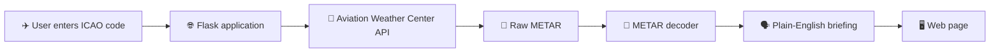
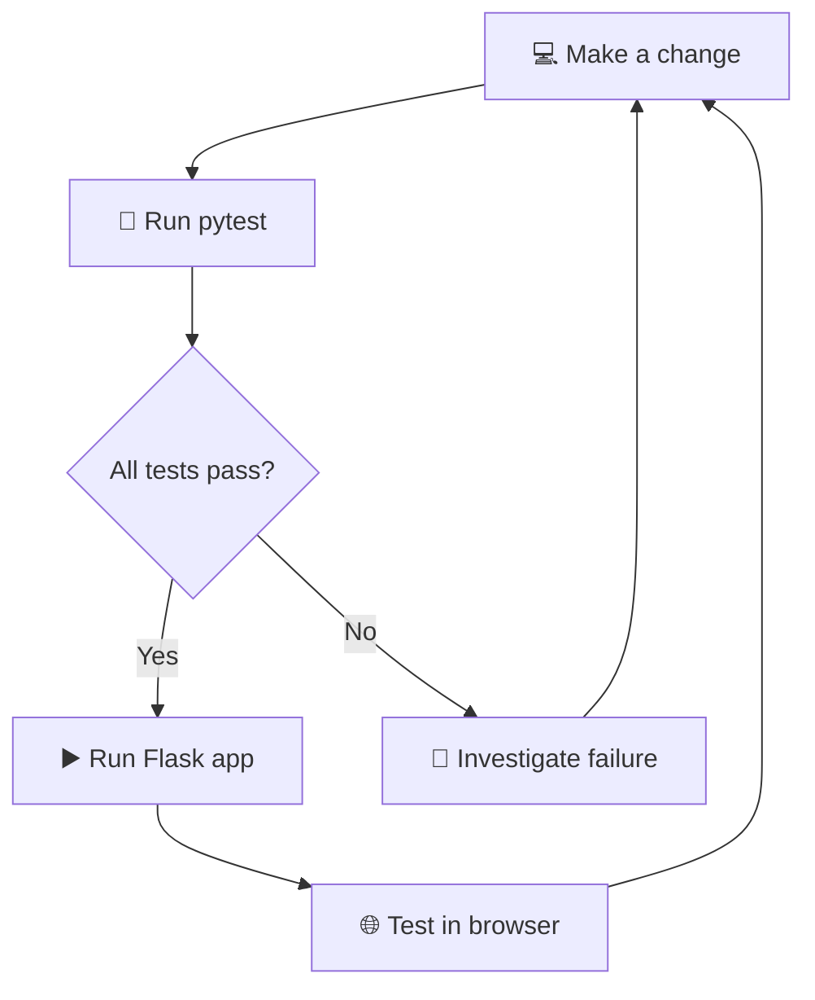

# ✈️ METAR Made Friendly

> **Turn aviation weather reports into plain English.**

METAR Made Friendly is a lightweight Flask web application that retrieves a current airport **METAR (Meteorological Aerodrome Report)** and translates common METAR information into easier-to-understand language.

Enter a four-letter ICAO airport code such as `KJFK`, `EGLL`, or `YSSY`, and the application retrieves the latest available METAR from the **Aviation Weather Center**.

---

## 👀 At a glance

| | |
|---|---|
| 🐍 **Language** | Python 3.9+ |
| 🌐 **Framework** | Flask |
| 📡 **Weather data** | Aviation Weather Center |
| 🧪 **Testing** | pytest |
| 🔌 **HTTP client** | Requests |
| 🎯 **Purpose** | Learning + METAR readability |

### ✨ Key features

- ✈️ Accepts a four-letter ICAO airport code
- 📡 Retrieves the latest available METAR
- 🔎 Parses common METAR fields
- 🗣️ Translates technical weather information into plain English
- 💨 Wind direction, speed and gusts
- 👁️ Visibility
- 🌧️ Weather conditions
- ☁️ Cloud coverage and cloud base
- 🌡️ Temperature and dew point
- 🎚️ Atmospheric pressure
- 🕐 Observation time
- 📄 Displays the original/raw METAR alongside the decoded information
- 🧪 Includes automated unit tests

---

## 🔄 How it works

The application follows a simple flow:



### Example

Enter:

```text
EGLL
```

The application retrieves the latest available METAR for London Heathrow and presents the report in a more readable format.

> ⚠️ **Important:** This application is a learning and readability aid. It is **not** a replacement for official aviation weather products, NOTAMs, flight briefings, or operational decision-making.

---

## 🧰 Technology stack

| Technology | Role |
|---|---|
| 🐍 Python | Application language |
| 🌐 Flask | Web framework |
| 📦 Requests | HTTP/API requests |
| 🎨 HTML/CSS | User interface |
| 📡 Aviation Weather Center API | METAR data source |
| 🧪 pytest | Automated testing |

---

## 📋 Prerequisites

Before installing the application, make sure you have:

- Python 3.9 or newer
- Git
- Internet access

---

## 🚀 Installation

### 1. Clone the repository

```bash
git clone https://github.com/Imcarter77/metarapp.git
cd metarapp
```

### 2. Create a virtual environment

#### Windows PowerShell

```powershell
python -m venv .venv
.\\.venv\\Scripts\\Activate.ps1
```

#### Linux / macOS

```bash
python3 -m venv .venv
source .venv/bin/activate
```

### 3. Install application dependencies

```bash
python -m pip install --upgrade pip
pip install -r requirements.txt
```

The application currently uses:

- Flask
- Requests

---

## ▶️ Run the application

From the project directory:

```bash
python app.py
```

You should see Flask start the development server.

Open:

```text
http://127.0.0.1:5000
```

Enter a four-letter ICAO airport code and submit the form to retrieve the latest available METAR.

### ⏹️ Stop the application

Press:

```text
Ctrl + C
```

in the terminal running Flask.

---

# 🧪 Testing

The project includes a **pytest unit-test suite** covering the METAR decoder, API interaction, and Flask input validation.

## Test coverage

| Test | What it checks |
|---|---|
| `test_decode_metar_interprets_common_fields` | Wind, gusts, rain, visibility, cloud layers, temperature and pressure |
| `test_decode_metar_interprets_negative_temperature_and_dew_point` | Negative temperature/dew-point values and pressure |
| `test_decode_metar_interprets_cavok_and_calm_wind` | CAVOK conditions and calm `00000KT` wind |
| `test_decode_metar_handles_us_fractional_visibility` | US-style fractional visibility such as `1 1/2SM` |
| `test_fetch_metar_uses_mocked_weather_service` | API request behaviour using a mocked weather response |
| `test_index_rejects_invalid_icao_code` | Validation of invalid/non-four-letter ICAO codes |

### 🧩 Why mocking is used

The API test does **not** call the live Aviation Weather Center service.

Instead, the test creates a mocked response:

```text
Test → Mock weather response → Application → Expected result
```

This makes the test:

- ⚡ Fast
- 🔁 Repeatable
- 🌐 Independent of the live API
- 🧪 Suitable for automated testing

---

## 📦 Install the testing dependency

The project keeps development/testing dependencies separate from the application dependencies.

Install them with:

```bash
pip install -r requirements-dev.txt
```

This installs pytest.

---

## ▶️ Run the unit tests

From the project root:

```bash
python -m pytest -v
```

The `-v` option enables **verbose output**, showing each test individually.

Example:

```text
============================= test session starts =============================
...
tests/test_app.py::test_decode_metar_interprets_common_fields PASSED
tests/test_app.py::test_decode_metar_interprets_negative_temperature_and_dew_point PASSED
tests/test_app.py::test_decode_metar_interprets_cavok_and_calm_wind PASSED
tests/test_app.py::test_decode_metar_handles_us_fractional_visibility PASSED
tests/test_app.py::test_fetch_metar_uses_mocked_weather_service PASSED
tests/test_app.py::test_index_rejects_invalid_icao_code PASSED
============================== 6 passed ==============================
```

> 💡 **Tip:** Run the tests after making changes to the METAR parsing logic. This helps catch regressions before changing or deploying the application.

### 🧪 Test file

All current unit tests are located in:

```text
tests/
└── test_app.py
```

The development testing dependency is defined in:

```text
requirements-dev.txt
```

---

## 🗂️ Project structure

```text
metarapp/
│
├── 🐍 app.py                    # Flask application + METAR decoder
├── 📦 requirements.txt          # Runtime dependencies
├── 🧪 requirements-dev.txt      # Development/test dependencies
├── 📖 README.md                 # Project documentation
│
├── 🧪 tests/
│   └── test_app.py              # pytest unit tests
│
├── 🎨 templates/
│   └── index.html               # Web interface
│
└── 🖼️ static/
    └── ...                      # Static assets
```

---

## 📡 API

The application uses the Aviation Weather Center METAR API:

```text
https://aviationweather.gov/api/data/metar
```

The application requests the latest available METAR for the supplied ICAO airport code and processes the returned report.

### Request flow

```text
ICAO code
   ↓
Aviation Weather Center API
   ↓
JSON response
   ↓
Raw METAR
   ↓
METAR decoder
   ↓
Plain-English result
```

---

## 🛠️ Development workflow

A simple development workflow for the project is:



For local development:

```bash
python app.py
```

When making changes, test the application locally and run the unit-test suite to verify that the METAR is retrieved and decoded correctly.

---

## 🤖 Built with OpenAI Codex

This application was developed with assistance from **OpenAI Codex**, an AI coding agent used to help write, understand, modify, and troubleshoot code directly within a development environment.

Codex provides a workflow comparable to **Anthropic's Claude Code**, allowing developers to work with an AI coding agent alongside their source code, terminal, and development tools.

The application remains a human-directed project: AI assistance was used during development, while the project requirements, review, testing, and final decisions remain with the developer.

---

## 📚 Learning goals

This project provides practical experience with:

- 🐍 Python
- 🌐 Flask
- 🔌 REST APIs
- 📄 JSON responses
- 🔎 Regular expressions
- 🧪 Unit testing with pytest
- 🎭 Mocking external services
- 🗂️ Git and GitHub
- 🛠️ Debugging
- 🤖 AI-assisted software development

---

## 📄 Licence

This project is provided for learning and development purposes.

---

## 👨‍💻 Developer

**Frederick Mensah**  
20/09/2026

© F.Mensah.
